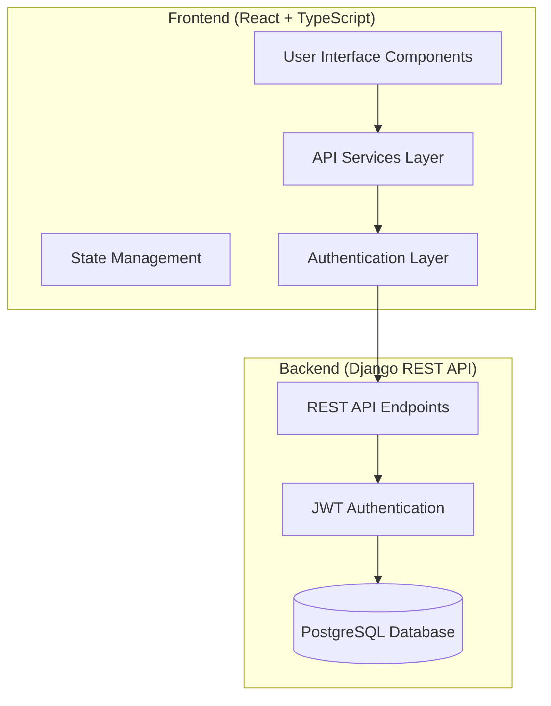

# Design Document

## Overview

The Pest Control CRM system will be implemented as a React TypeScript application that communicates with a Django REST Framework backend. The system will provide comprehensive customer relationship management capabilities including secure JWT authentication, client management with soft delete functionality, inquiry handling with conversion capabilities, job card tracking with payment status management, renewal management with urgency indicators, and comprehensive dashboard analytics with caching optimization.

## Architecture

### High-Level Architecture



### Frontend Architecture

The frontend will follow a layered architecture pattern:

1. **Presentation Layer**: React components with TypeScript
2. **Service Layer**: API communication and data transformation
3. **Authentication Layer**: JWT token management and security
4. **State Management**: React hooks and context for local state

### Technology Stack

- **Frontend Framework**: React 19.1.1 with TypeScript
- **Routing**: React Router DOM 7.9.4
- **HTTP Client**: Axios 1.12.2
- **State Management**: React Query (TanStack Query) 5.90.5
- **UI Components**: Custom components with Tailwind CSS
- **Authentication**: JWT tokens with automatic refresh

## Components and Interfaces

### Core Components Structure

```
src/
├── components/
│   ├── ui/                    # Reusable UI components
│   ├── layout/                # Layout components
│   ├── auth/                  # Authentication components
│   └── forms/                 # Form components
├── pages/                     # Page components
├── services/                  # API services
├── hooks/                     # Custom React hooks
├── types/                     # TypeScript type definitions
├── utils/                     # Utility functions
└── config/                    # Configuration files
```

### Key Components

#### 1. Authentication Components
- **Login**: JWT authentication with form validation and error handling
- **ProtectedRoute**: Route protection with authentication checks and automatic redirects
- **AuthProvider**: Context provider for authentication state with token management
- **TokenRefreshHandler**: Automatic token refresh component with 401 error handling
- **LogoutHandler**: Complete session cleanup and token removal on logout

#### 2. Dashboard Components
- **Dashboard**: Main dashboard with comprehensive statistics including inquiry, job card, and renewal metrics
- **StatsCard**: Reusable statistics display component with loading and error states
- **InquiryStatsWidget**: Inquiry statistics showing counts by status (New, Contacted, Converted)
- **JobCardStatsWidget**: Job card statistics with status distribution and payment tracking
- **RenewalStatsWidget**: Renewal statistics with urgency level breakdown
- **ReferenceReportWidget**: Reference tracking reports showing job sources

#### 3. Client Management Components
- **ClientList**: Paginated client listing with search across name, mobile, and email fields
- **ClientForm**: Create/edit client form with mobile number uniqueness validation
- **ClientDetail**: Detailed client information view with soft delete (deactivation) functionality
- **ClientSelector**: Reusable client selection component for job card creation

#### 4. Inquiry Management Components
- **InquiryList**: Inquiry listing with status management (New, Contacted, Converted, Closed)
- **InquiryForm**: Create/edit inquiry form with status updates
- **InquiryDetail**: Detailed inquiry view with conversion to job card functionality
- **InquiryStatusBadge**: Visual status indicators with read/unread states

#### 5. Job Card Management Components
- **JobCardList**: Job card listing with advanced filtering by status, payment, city, and date ranges
- **JobCardForm**: Create/edit job card with automatic code generation and client integration
- **JobCardDetail**: Comprehensive job card information with payment status management
- **PaymentStatusUpdate**: Payment status management (Paid/Unpaid) with update capabilities
- **JobCardStatusBadge**: Visual status indicators for job card states
- **PauseResumeToggle**: Job card pause/resume functionality component

#### 6. Renewal Management Components
- **RenewalList**: Renewal listing with color-coded urgency indicators (High-Red, Medium-Yellow, Normal-Green)
- **RenewalForm**: Create/edit renewal form with completion marking
- **RenewalSummary**: Upcoming renewals dashboard widget with urgency breakdown
- **UrgencyIndicator**: Visual urgency level component with automatic calculation based on due dates
- **RenewalStatusBadge**: Status indicators for Due/Completed renewals

### API Service Layer

#### Enhanced API Service Architecture

```typescript
interface APIService {
  // Authentication
  auth: {
    login(credentials: LoginCredentials): Promise<AuthResponse>
    refresh(token: string): Promise<TokenResponse>
    logout(): Promise<void>
  }
  
  // Clients
  clients: {
    list(params?: ClientFilters): Promise<PaginatedResponse<Client>>
    get(id: number): Promise<Client>
    create(data: ClientFormData): Promise<Client>
    update(id: number, data: Partial<ClientFormData>): Promise<Client>
    deactivate(id: number): Promise<Client> // Soft delete implementation
    search(query: string): Promise<Client[]> // Search across name, mobile, email
    checkMobileUniqueness(mobile: string, excludeId?: number): Promise<boolean>
  }
  
  // Inquiries
  inquiries: {
    list(params?: InquiryFilters): Promise<PaginatedResponse<Inquiry>>
    get(id: number): Promise<Inquiry>
    create(data: InquiryFormData): Promise<Inquiry>
    update(id: number, data: Partial<InquiryFormData>): Promise<Inquiry>
    updateStatus(id: number, status: InquiryStatus): Promise<Inquiry>
    convert(id: number, data: ConversionData): Promise<JobCard>
    markAsRead(id: number): Promise<void>
    markAsUnread(id: number): Promise<void>
    filterByStatus(status: InquiryStatus): Promise<PaginatedResponse<Inquiry>>
    filterByCity(city: string): Promise<PaginatedResponse<Inquiry>>
    delete(id: number): Promise<void>
  }
  
  // Job Cards
  jobCards: {
    list(params?: JobCardFilters): Promise<PaginatedResponse<JobCard>>
    get(id: number): Promise<JobCard>
    create(data: JobCardFormData): Promise<JobCard>
    update(id: number, data: Partial<JobCardFormData>): Promise<JobCard>
    updatePaymentStatus(id: number, status: PaymentStatus): Promise<JobCard>
    checkClient(mobile: string): Promise<ClientCheckResponse>
    getStatistics(): Promise<JobCardStatistics>
    getReferenceReport(): Promise<ReferenceReport>
  }
  
  // Renewals
  renewals: {
    list(params?: RenewalFilters): Promise<PaginatedResponse<Renewal>>
    get(id: number): Promise<Renewal>
    update(id: number, data: Partial<RenewalFormData>): Promise<Renewal>
    markCompleted(id: number): Promise<Renewal>
    getUpcomingSummary(): Promise<RenewalSummary>
    filterByUrgency(urgency: UrgencyLevel): Promise<PaginatedResponse<Renewal>>
    filterByStatus(status: RenewalStatus): Promise<PaginatedResponse<Renewal>>
    calculateUrgency(dueDate: string): UrgencyLevel
  }
}
```

## Data Models

### Core Data Models

Based on the API documentation, the following TypeScript interfaces will be implemented:

#### Client Model
```typescript
interface Client {
  id: number
  full_name: string
  mobile: string
  email?: string
  city?: string
  address?: string
  notes?: string
  is_active: boolean
  created_at: string
  updated_at: string
}
```

#### Inquiry Model
```typescript
interface Inquiry {
  id: number
  name: string
  mobile: string
  email?: string
  message: string
  service_interest: string
  city?: string
  status: 'New' | 'Contacted' | 'Converted' | 'Closed'
  is_read: boolean
  created_at: string
  updated_at: string
}
```

#### Job Card Model
```typescript
interface JobCard {
  id: number
  code: string
  client: number
  client_name: string
  client_mobile: string
  client_city?: string
  job_type: 'Customer' | 'Society'
  contract_duration?: '12' | '6' | '3'
  status: 'Enquiry' | 'WIP' | 'Done' | 'Hold' | 'Cancel' | 'Inactive'
  service_type: string
  schedule_date?: string
  price?: string
  payment_status: 'Unpaid' | 'Paid'
  next_service_date?: string
  notes?: string
  is_paused: boolean
  reference?: string
  created_at: string
  updated_at: string
}
```

#### Renewal Model
```typescript
interface Renewal {
  id: number
  jobcard: number
  jobcard_code: string
  client_name: string
  is_paused: boolean
  due_date: string
  status: 'Due' | 'Completed'
  renewal_type: 'Contract' | 'Monthly'
  urgency_level: 'High' | 'Medium' | 'Normal'
  urgency_color: string
  remarks?: string
  created_at: string
  updated_at: string
}
```

## Error Handling

### Error Handling Strategy

1. **API Error Handling**
   - Standardized error response transformation (requirement 8.2)
   - User-friendly error messages for all API failures (requirement 8.2)
   - Automatic retry logic for failed network requests (requirement 8.1)
   - Fallback error states with recovery options

2. **Authentication Error Handling**
   - Automatic token refresh on 401 errors (requirement 1.2)
   - Redirect to login page when authentication fails or refresh token is invalid (requirement 1.3)
   - Clear error messages for invalid credentials
   - Session cleanup on authentication failures

3. **Form Validation**
   - Client-side validation with immediate feedback (requirement 7.4)
   - Server-side validation error display with field-level messages
   - Mobile number format and uniqueness validation (requirement 2.2)
   - Real-time validation feedback for better user experience

4. **Network Error Handling**
   - Retry logic for transient network failures (requirement 8.1)
   - Offline state detection and user notification
   - Loading states during all API requests (requirement 7.3)
   - Request timeout handling with appropriate user feedback

### Error Types

```typescript
interface APIError {
  message: string
  status: number
  details?: Record<string, string[]>
}

interface ValidationError {
  field: string
  message: string
}

interface InquiryStatus {
  NEW: 'New'
  CONTACTED: 'Contacted'
  CONVERTED: 'Converted'
  CLOSED: 'Closed'
}

interface UrgencyLevel {
  HIGH: 'High'
  MEDIUM: 'Medium'
  NORMAL: 'Normal'
}

interface RenewalStatus {
  DUE: 'Due'
  COMPLETED: 'Completed'
}
```

## Testing Strategy

### Testing Approach

1. **Unit Testing**
   - Component testing with React Testing Library
   - Service layer testing with mocked API responses
   - Utility function testing
   - Custom hook testing

2. **Integration Testing**
   - API service integration tests
   - Authentication flow testing
   - Form submission testing
   - Navigation testing

3. **End-to-End Testing**
   - Critical user journey testing
   - Authentication flow testing
   - CRUD operations testing
   - Cross-browser compatibility

### Testing Tools

- **Unit Testing**: Jest + React Testing Library
- **API Mocking**: MSW (Mock Service Worker)
- **E2E Testing**: Playwright or Cypress
- **Coverage**: Jest coverage reports

## Performance Optimizations

### Frontend Performance

1. **Code Splitting**
   - Route-based code splitting
   - Component lazy loading
   - Dynamic imports for heavy components

2. **API Optimization**
   - Response caching with React Query
   - Request deduplication
   - Pagination for large datasets
   - Optimistic updates

3. **Rendering Optimization**
   - React.memo for expensive components
   - useMemo and useCallback for expensive calculations
   - Virtual scrolling for large lists

4. **Bundle Optimization**
   - Tree shaking for unused code
   - Asset optimization
   - Compression and minification

### Caching Strategy

1. **API Response Caching**
   - Client list: 5 minutes (requirement for performance optimization)
   - Job card statistics: 1 minute (requirement for real-time dashboard updates)
   - Renewal summary: 5 minutes (requirement for dashboard performance)
   - Dashboard data: 2 minutes (requirement 6.5 for cached dashboard statistics)
   - Inquiry statistics: 2 minutes (requirement for dashboard performance)

2. **Browser Caching**
   - Static assets caching with versioning
   - Service worker for offline support and improved performance
   - Local storage for user preferences and authentication state
   - Session storage for temporary form data

## Security Considerations

### Authentication Security

1. **JWT Token Management**
   - Secure token storage in memory/httpOnly cookies
   - Automatic token refresh on 401 errors with seamless user experience
   - Token expiration handling with redirect to login when refresh fails
   - Complete token cleanup on logout with session termination
   - Authentication state persistence across browser sessions

2. **API Security**
   - Request/response validation with TypeScript interfaces
   - CORS configuration for secure cross-origin requests
   - Rate limiting awareness and graceful degradation
   - Input sanitization for all form inputs
   - Request interceptors for consistent authentication headers

3. **Data Protection**
   - Sensitive data masking in UI components
   - Secure form handling with validation
   - XSS prevention through proper data encoding
   - CSRF protection via token-based authentication
   - Protected route implementation with authentication checks

## Deployment and Configuration

### Environment Configuration

1. **Development Environment**
   - Local API endpoint
   - Debug logging enabled
   - Hot reload support
   - Development tools integration

2. **Production Environment**
   - Production API endpoint
   - Error reporting
   - Performance monitoring
   - Security optimizations

### Configuration Management

```typescript
interface AppConfig {
  apiBaseUrl: string
  environment: 'development' | 'production'
  apiVersion: string
  requestTimeout: number
  debugMode: boolean
  logLevel: 'error' | 'warn' | 'info' | 'debug'
  enableAnalytics: boolean
  enableErrorReporting: boolean
}
```

## Design Rationale

### Key Design Decisions

1. **Soft Delete for Clients**: Implemented deactivation instead of permanent deletion to maintain data integrity and historical records (requirement 2.4). This ensures that existing job cards and renewals maintain their client relationships.

2. **Automatic Token Refresh**: Designed seamless token refresh mechanism to handle expired access tokens without user interruption (requirement 1.2). This improves user experience by preventing unexpected logouts during active sessions.

3. **Color-Coded Urgency System**: Implemented visual urgency indicators (Red/Yellow/Green) for renewals based on due date calculations (requirement 5.2). This provides immediate visual feedback for prioritizing renewal activities.

4. **Comprehensive Filtering System**: Designed advanced filtering capabilities across all modules (clients, inquiries, job cards, renewals) to support efficient data management and user productivity (requirements 2.5, 3.4, 4.5, 5.4).

5. **Caching Strategy**: Implemented strategic API response caching with different TTL values based on data volatility to optimize performance while ensuring data freshness (requirement 6.5).

6. **Mobile Number Uniqueness**: Enforced mobile number uniqueness validation to prevent duplicate client records and ensure data integrity (requirement 2.2).

7. **Inquiry Conversion Workflow**: Designed streamlined conversion process from inquiries to job cards with automatic status updates to maintain workflow consistency (requirement 3.3).

8. **Responsive Design Priority**: Prioritized mobile-first responsive design to ensure accessibility across all device types, recognizing the field-based nature of pest control operations (requirement 7.1).

## Implementation Phases

### Phase 1: Core Infrastructure
- Authentication system
- API service layer
- Basic routing
- Layout components

### Phase 2: Client Management
- Client CRUD operations
- Client listing and search
- Client form validation

### Phase 3: Inquiry Management
- Inquiry CRUD operations
- Status management
- Conversion functionality

### Phase 4: Job Card Management
- Job card CRUD operations
- Payment status management
- Advanced filtering

### Phase 5: Renewal Management
- Renewal tracking
- Urgency calculation
- Completion management

### Phase 6: Dashboard and Analytics
- Statistics dashboard
- Reference reports
- Performance optimization

### Phase 7: Polish and Testing
- Comprehensive testing
- Performance optimization
- Bug fixes and refinements